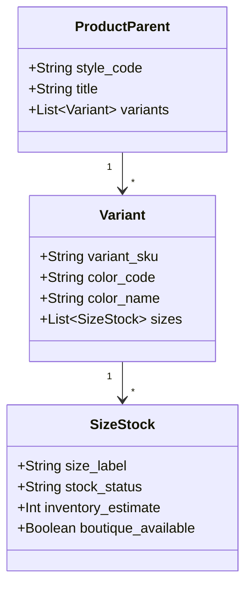

# BÁO CÁO 04: VARIANTS, MATRIX & INVENTORY STATUS (BIẾN THỂ & TỒN KHO)
**Dự án:** DM Fashion Data Tools  
**Đối tượng phân tích:** Dior, Gucci, Adidas

---

## 1. Mục đích & Tầm quan trọng
Trong thời trang, người dùng không mua "một mẫu áo sơ mi chung chung" mà mua "áo sơ mi màu trắng, cỡ 39". Do đó, ma trận biến thể (Variant Matrix: Size x Color) và trạng thái tồn kho (Stock Availability) là thành phần có độ phức tạp cao nhất trong toàn bộ hệ thống crawler. Việc thu thập chính xác dữ liệu này cho phép phân tích tốc độ bán ra (Sell-through rate) và phát hiện các mặt hàng hot (Sold-out rate).

---

## 2. Bảng phân tích chi tiết các trường dữ liệu (Field Schema)

| Tên trường (Field Name) | Kiểu dữ liệu | Bắt buộc | Mô tả chức năng | Ví dụ Dior | Ví dụ Gucci | Ví dụ Adidas |
| :--- | :--- | :--- | :--- | :--- | :--- | :--- |
| `variant_id` | String | Có | ID riêng biệt của từng biến thể con | `M1296ZRGO_M928_TU` | `735113_FACVY_8440_U` | `IG1025_650` |
| `color_name` | String | Có | Tên gọi thương mại của màu sắc | `Blue Toile de Jouy` | `Beige and ebony GG Supreme` | `Cloud White / Core Black` |
| `color_family` | String | Có | Nhóm màu cơ bản (để lọc chuẩn) | `Blue` | `Beige`, `Brown` | `White` |
| `color_hex` | String (Hex) | Không | Mã màu hiển thị dạng Hexcode nếu có | `#1E3A5F` | `#C8B195` | `#FFFFFF` |
| `color_code_internal`| String | Không | Mã định danh màu của nhà sản xuất | `M928` | `8440` | `FTWWHT/CBLACK` |
| `size_value` | String | Có | Giá trị kích thước thực tế | `36` (cm) hoặc `TU` (Taille Unique)| `Small`, `Medium` | `US 8.5` / `UK 8` / `EU 42` |
| `size_scale` | String | Có | Hệ quy chuẩn kích thước | `One Size` | `Bags Dimension` | `US Men Footwear` |
| `stock_status` | Enum | Có | Trạng thái tồn kho tổng thể | `IN_STOCK` | `LOW_STOCK` | `OUT_OF_STOCK` |
| `stock_level` | Integer | Không | Số lượng còn lại chính xác (nếu rò rỉ qua API) | `null` | `null` | `3` (còn 3 đôi) |
| `is_backorder` | Boolean | Có | Cho phép đặt trước (Pre-order) | `false` | `true` ("Pre-order for Nov") | `false` |
| `available_in_boutique` | Boolean | Không | Có hàng tại cửa hàng trực tiếp không | `true` ("Find in boutique") | `true` | `false` |
| `boutique_locations` | Array[Object]| Không | Danh sách boutique còn hàng tại thành phố | `[{"store": "Dior Paris Montaigne", "qty": "Available"}]` | `[{"store": "Gucci Milan", "status": "In Store"}]` | `null` |

---

## 3. Khác biệt cấu trúc biến thể: Dior/Gucci vs Adidas



### 3.1. Đối với Dior & Gucci (Luxury)
- **Túi xách & Phụ kiện:** Thường có kích cỡ dạng kích thước túi (`Mini`, `Small`, `Medium`, `Large`) hoặc One Size (`TU` - Taille Unique).
- **Quần áo (Ready-to-wear):** Dùng chuẩn size Pháp/Ý (Dior: `FR 34, 36, 38, 40...`, Gucci: `IT 38, 40, 42, 44...`).
- **Phân phối tồn kho:** Không bao giờ để lộ số lượng tồn cụ thể trong kho trung tâm. Thay vào đó có tính năng **"Find in Store / In-store Availability"** gọi API nội bộ trả về trạng thái còn hàng tại các Storeflagship.

### 3.2. Đối với Adidas (Sportswear)
- **Ma trận kích thước giày siêu chi tiết:** Bước nhảy nửa cỡ (`US 7, 7.5, 8, 8.5, 9, 9.5...`).
- **Hệ thống chuyển đổi đa kích cỡ (Size Conversion):** Một đôi giày lưu trữ đồng thời `US`, `UK`, `FR/EU`, `JP`, `CHN`.
- **Dữ liệu tồn kho chi tiết:** Adidas dùng Salesforce Commerce Cloud (Demandware), API thường trả về trường `ATS` (Available to Sell) hoặc trường `orderable: true/false` kèm số lượng giới hạn `max_order_quantity`.

---

## 4. Thách thức trích xuất & Giải pháp kỹ thuật

1. **Size và tồn kho được nạp Async (Bất đồng bộ) khi người dùng click vào màu:**
   - *Vấn đề:* Truy cập trang sản phẩm chỉ hiển thị màu mặc định. Các màu khác và tồn kho của size được gọi qua AJAX API.
   - *Giải pháp:* Không cào bằng cách click DOM chậm chạp. Bắt gói tin XHR/Fetch trực tiếp:
     - *Dior:* Endpoint `/couture/en_int/products/{SKU}/stock` hoặc Algolia index.
     - *Adidas:* Endpoint `/api/products/{ARTICLE_ID}/availability`.
2. **Theo dõi biến động hàng (Stock Monitoring / Drop Alert):**
   - Định kỳ thăm dò riêng biệt endpoint `availability` (tần suất 15 phút/lần đối với các drop hot như Samba OG, YEEZY hoặc collab Dior Men) thay vì cào lại toàn bộ trang HTML.

---

## 5. Mẫu JSON Data Object chuẩn hóa

```json
{
  "parent_sku": "IG1025",
  "variants": [
    {
      "variant_sku": "IG1025_M",
      "color": {
        "name": "Cloud White / Core Black",
        "hex": "#FFFFFF",
        "swatch_url": "https://assets.adidas.com/.../swatch_IG1025.jpg"
      },
      "sizes": [
        {
          "size_us": "8.5",
          "size_uk": "8.0",
          "size_eu": "42",
          "size_cm": "26.5",
          "is_available": true,
          "stock_status": "IN_STOCK",
          "estimated_stock_quantity": 8
        },
        {
          "size_us": "9.0",
          "size_uk": "8.5",
          "size_eu": "42 2/3",
          "size_cm": "27.0",
          "is_available": false,
          "stock_status": "OUT_OF_STOCK",
          "estimated_stock_quantity": 0
        }
      ]
    }
  ]
}
```
