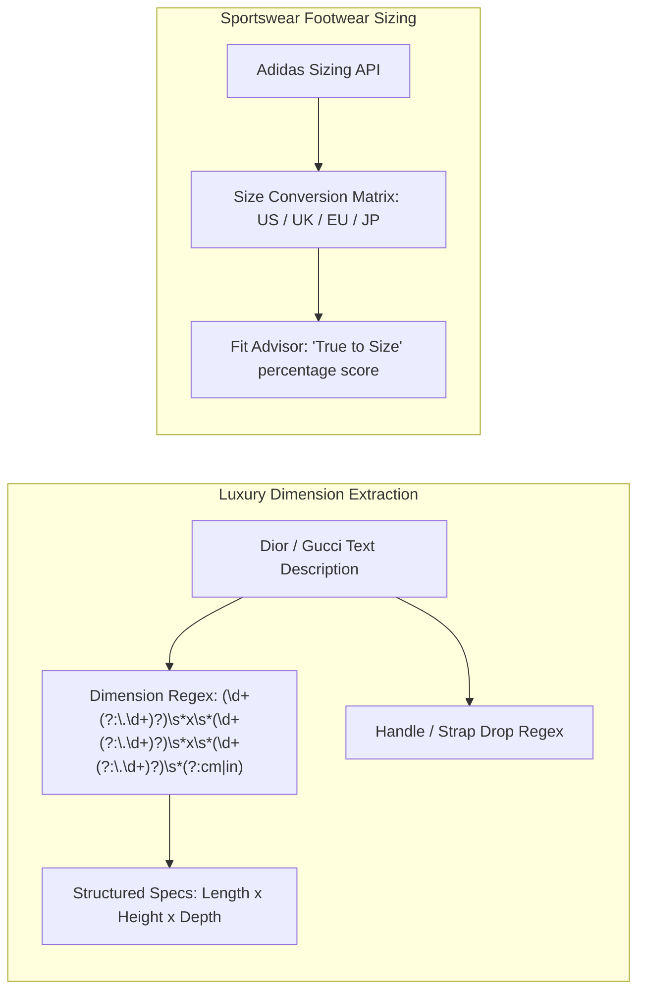

# BÁO CÁO 07: FIT, MEASUREMENTS & SIZING GUIDE (PHOM DÁNG, THÔNG SỐ & SIZE GUIDE)
**Dự án:** DM Fashion Data Tools  
**Đối tượng phân tích:** Dior, Gucci, Adidas

---

## 1. Mục đích & Tầm quan trọng
Nguyên nhân số 1 dẫn đến tình trạng đổi trả hàng (Return Rate lên đến 30-40% trong eCommerce thời trang) là vấn đề sai lệch kích thước và phom dáng. Đối với túi xách hàng hiệu, kích thước tính theo centimet (Dài x Cao x Rộng, Độ dài quai đeo Strap drop) quyết định tính tiện dụng (chứa vừa iPhone Pro Max, iPad, hay laptop 13-inch). Đối với quần áo và giày, việc thu thập thông số người mẫu (Model stats) và bảng quy đổi kích cỡ (Size chart) là cốt lõi để khách hàng ra quyết định mua sắm.

---

## 2. Bảng phân tích chi tiết các trường dữ liệu (Field Schema)

| Tên trường (Field Name) | Kiểu dữ liệu | Bắt buộc | Mô tả chức năng | Ví dụ Dior | Ví dụ Gucci | Ví dụ Adidas |
| :--- | :--- | :--- | :--- | :--- | :--- | :--- |
| `fit_type` | Enum | Có | Phom dáng tổng thể | `Regular fit`, `Oversized` | `Fitted`, `Relaxed` | `Regular fit`, `Slim fit`, `Loose fit` |
| `item_dimensions` | Object | Tùy chọn | Kích thước vật lý (dành cho Túi xách, Phụ kiện) | `{"length_cm": 36, "height_cm": 27.5, "depth_cm": 16.5}` | `{"length_cm": 28, "height_cm": 19, "depth_cm": 4.5}` | `{"length_cm": 30, "height_cm": 45, "depth_cm": 15}` (Ba lô) |
| `strap_drop_cm` | Float | Không | Độ dài thả quai đeo (túi xách) | `null` (quai ngắn) | `18.0` cm (tối đa `52.0` cm có dây nối)| `null` |
| `heel_height_mm` | Float | Không | Độ cao gót giày (nếu là giày cao gót/đế) | `45` mm | `75` mm | `null` |
| `weight_grams` | Float | Không | Trọng lượng vật lý của sản phẩm | `null` | `450` g | `340` g (Giày chạy) |
| `model_stats` | Object | Không | Thông số của người mẫu trong ảnh lookbook | `{"height_cm": 179, "wearing_size": "36 FR"}` | `{"height_cm": 177, "wearing_size": "S"}` | `{"height_cm": 188, "chest_cm": 98, "wearing_size": "M"}` |
| `size_chart_matrix` | Array[Object]| Không | Bảng ma trận chuyển đổi size | `[{"FR": 36, "IT": 40, "US": 4, "Bust_cm": 84}]` | `[{"IT": 38, "US": 2, "Waist_cm": 64}]` | `[{"US": 9, "UK": 8.5, "EU": 42.6, "Foot_cm": 26.7}]` |
| `fit_recommendation` | String | Không | Lời khuyên chọn size từ hãng | `"The style fits true to size"` | `"We recommend ordering your usual size"` | `"Runs small, order half size up"` |

---

## 3. Khác biệt đo lường giữa Luxury Bags/Couture vs Sportswear Sneakers/Apparel



### 3.1. Đối với Dior & Gucci (Túi xách, Thời trang may đo)
- Dữ liệu kích thước túi luôn được cung cấp theo cấu trúc: `Length x Height x Depth` kèm theo đơn vị đo (cm hoặc inches).
- Cung cấp khả năng chứa đồ thực tế: *"Designed to hold a wallet, phone, and keys"* hoặc *"Can accommodate a 15-inch laptop"*.
- Quai đeo có thể tháo rời/điều chỉnh: Chiều dài dây tối thiểu và tối đa.

### 3.2. Đối với Adidas (Giày dép, Quần áo thể thao)
- Dữ liệu phom dáng rất đa dạng: `Regular fit`, `Slim fit`, `Tapered leg`, `Compression fit`.
- Hệ thống đánh giá độ ôm chân từ cộng đồng (User Fit Feedback): Thường có thang điểm hiển thị: *"78% người mua đánh giá vừa vặn đúng size (True to size)"*.

---

## 4. Thách thức trích xuất & Giải pháp kỹ thuật

1. **Chuỗi kích thước đa dạng định dạng:**
   - *Ví dụ Dior:* `Dimensions: 36 x 27.5 x 16.5 cm / 14 x 11 x 6.5 inches`.
   - *Ví dụ Gucci:* `W28cm x H19cm x D4.5cm`.
   - *Giải pháp:* Viết parser bóc tách độc lập các chiều:
     ```python
     def extract_dimensions(text):
         # Bắt mẫu: 36 x 27.5 x 16.5 cm
         match = re.search(r'(\d+(?:\.\d+)?)\s*[xX*]\s*(\d+(?:\.\d+)?)\s*[xX*]\s*(\d+(?:\.\d+)?)\s*(cm|mm|inches|in)', text)
         if match:
             l, h, d, unit = match.groups()
             return {
                 "length": float(l),
                 "height": float(h),
                 "depth": float(d),
                 "unit": unit.lower()
             }
         return None
     ```
2. **Thông số người mẫu nằm lẫn trong chú thích ảnh:**
   - *Pattern:* `"The model is 178 cm / 5'10" tall and wears size S"`. Cần parser để trích xuất `model_height_cm` và `model_wearing_size`.

---

## 5. Mẫu JSON Data Object chuẩn hóa

```json
{
  "sku": "dior_M1296ZRGO",
  "sizing_and_fit": {
    "fit_category": "Tote Bag Medium Size",
    "dimensions": {
      "length_cm": 36.0,
      "height_cm": 27.5,
      "depth_cm": 16.5,
      "length_in": 14.0,
      "height_in": 11.0,
      "depth_in": 6.5
    },
    "strap_info": {
      "is_removable": false,
      "is_adjustable": false,
      "strap_drop_cm": 16.0
    },
    "model_stats": {
      "height_cm": 179,
      "wearing_size": "One Size"
    },
    "capacity_notes": "Holds a 13-inch laptop, a wallet, phone and makeup pouch"
  }
}
```
