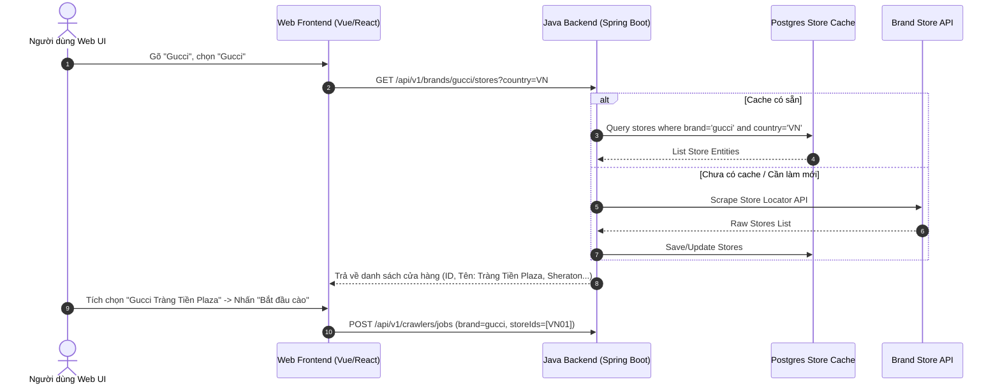

# BÁO CÁO 11: STORE LOCATOR & PHYSICAL BOUTIQUE INVENTORY MAPPING
**Dự án:** DM Fashion Data Tools (Java Web System)  
**Mục tiêu:** Quét danh sách cửa hàng thực tế và ánh xạ tồn kho chi nhánh (Ví dụ: Gucci Tràng Tiền Plaza, Dior Sheraton Saigon, Adidas Vincom...)

---

## 1. Mục đích & Tầm quan trọng
Khi người dùng chọn một thương hiệu (ví dụ: Gucci) và muốn kiểm tra hoặc cào dữ liệu tại một cơ sở cụ thể như **Gucci Tràng Tiền Plaza (Hà Nội)** hay chọn nhiều cơ sở cùng lúc, hệ thống cần giải quyết bài toán:
1. Xác định danh sách tất cả các điểm bán vật lý (Boutiques / Physical Stores) của thương hiệu đó trên toàn cầu hoặc lọc theo quốc gia (Việt Nam, Pháp, Mỹ...).
2. Ánh xạ mã định danh nội bộ của cửa hàng (Store ID / Store Code).
3. Gọi API kiểm tra tồn kho tại cửa hàng (In-Store Stock Availability / Click-and-Collect API) gắn liền với từng mã biến thể SKU.

---

## 2. Bảng phân tích cấu trúc dữ liệu Điểm bán (Store Schema)

| Tên trường (Field Name) | Kiểu dữ liệu | Bắt buộc | Mô tả chức năng | Ví dụ Gucci VN | Ví dụ Dior VN | Ví dụ Adidas VN |
| :--- | :--- | :--- | :--- | :--- | :--- | :--- |
| `store_id` | String | Có | Mã định danh cửa hàng trong hệ thống hãng | `gucci_vn_tt_plaza` | `dior_vn_hn_tt` | `adidas_vn_bcs_hanoi` |
| `brand_id` | String | Có | Mã thương hiệu sở hữu | `gucci` | `dior` | `adidas` |
| `store_name` | String | Có | Tên hiển thị cửa hàng | `Gucci Trang Tien Plaza` | `Dior Hanoi Trang Tien` | `Adidas Brand Center Ba Trieu` |
| `store_type` | Enum | Có | Loại hình điểm bán | `FLAGSHIP_BOUTIQUE` | `BOUTIQUE` | `BRAND_CENTER`, `OUTLET` |
| `city` | String | Có | Thành phố trực thuộc | `Ha Noi` | `Ha Noi` | `Ha Noi` |
| `country_code` | String (2) | Có | Mã quốc gia ISO | `VN` | `VN` | `VN` |
| `address_line` | String | Có | Địa chỉ chi tiết | `Tràng Tiền Plaza, 24 Hai Bà Trưng` | `Tràng Tiền Plaza, Hoàn Kiếm` | `Vincom Bà Triệu, Hai Bà Trưng` |
| `latitude` | Double | Không | Tọa độ vĩ độ (để tính khoảng cách) | `21.0245` | `21.0246` | `21.0115` |
| `longitude` | Double | Không | Tọa độ kinh độ | `105.8532` | `105.8531` | `105.8492` |
| `phone_number` | String | Không | Số điện thoại liên hệ | `+84 24 3936 9999` | `+84 24 3824 0000` | `+84 24 3974 0000` |
| `supports_online_reservation` | Boolean | Có | Hỗ trợ đặt giữ hàng tại cửa hàng (Hold in Store)| `true` | `true` | `true` (BOPIS) |
| `inventory_api_endpoint` | String | Có | Mẫu URL API kiểm tra hàng tại store này | `/api/store/{id}/stock` | `/couture/stock/store` | `/api/bopis/stores/{id}` |

---

## 3. Khảo sát API Store Locator thực tế của Gucci, Dior, Adidas

### 3.1. Gucci Store Locator API
- Endpoint danh sách cửa hàng:
  `GET https://www.gucci.com/us/en/store-finder/search?country=VN`
- Endpoint kiểm tra tồn kho tại cửa hàng:
  `GET https://www.gucci.com/us/en/store-finder/availability?sku=735113FACVY8440&storeId=VN01`
- Trả về JSON:
  ```json
  {
    "storeCode": "VN01",
    "storeName": "Gucci Trang Tien Plaza",
    "availabilityStatus": "AVAILABLE", 
    "availableQuantity": "FEW_PIECES",
    "canReserve": true
  }
  ```

### 3.2. Dior Boutique Finder & Stock API
- Endpoint: `POST https://www.dior.com/couture/en_int/api/product/{sku}/in-store-availability`
- Payload gửi lên: `{"countryCode": "VN", "city": "Hanoi"}`
- Kết quả trả về các cửa hàng có sẵn hàng (`IN_STOCK`, `CALL_BOUTIQUE`, `OUT_OF_STOCK`).

### 3.3. Adidas Store Pickup (BOPIS - Buy Online Pickup In Store)
- Dựa trên Salesforce Commerce Cloud:
  `GET https://www.adidas.com.vn/api/stores?latitude=21.0285&longitude=105.8542&radius=50&productId=IG1025`
- Trả về danh sách cửa hàng kèm trạng thái `stockLevel: "IN_STOCK" | "LOW_STOCK" | "OUT_OF_STOCK"`.

---

## 4. Giải pháp kiến trúc Java cho cơ chế chọn Store


