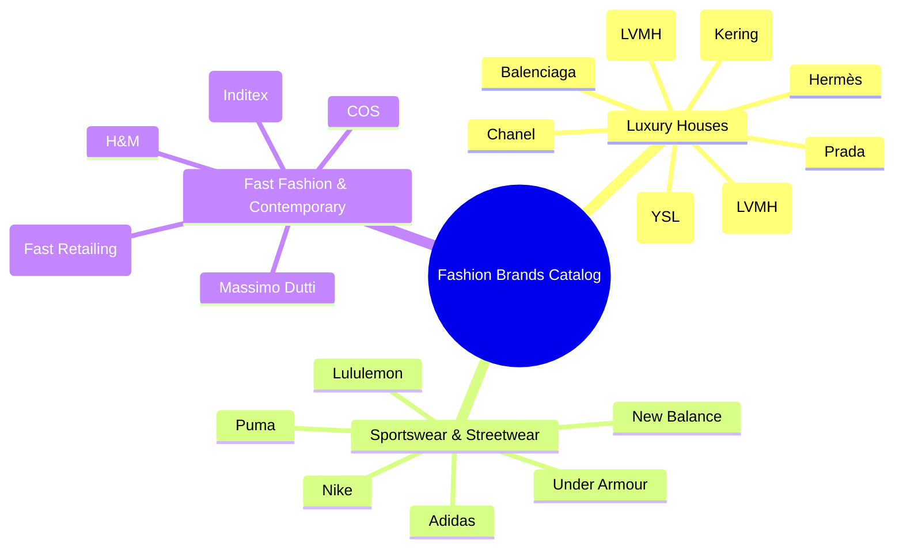

# BÁO CÁO 12: MULTI-BRAND AUTOCOMPLETE & GLOBAL BRAND CATALOG ARCHITECTURE
**Dự án:** DM Fashion Data Tools (Java Web System)  
**Mục tiêu:** Thiết kế bộ máy gợi ý thương hiệu thông minh (Brand Autocomplete) và kiến trúc danh mục mở rộng không giới hạn hãng

---

## 1. Mục đích & Yêu cầu nghiệp vụ
Hệ thống Web cần cung cấp ô tìm kiếm nhanh (Search Box) với khả năng tự động hoàn thành (Autocomplete/Typeahead). Khi người dùng gõ bất kỳ ký tự nào (ví dụ: `g`, `gu`, `guc` -> gợi ý `Gucci`; gõ `d`, `di` -> gợi ý `Dior`, `Diadora`; gõ `ad` -> gợi ý `Adidas`), hệ thống phải phản hồi tức thì (< 50ms), hỗ trợ tìm kiếm không dấu tiếng Việt, tìm theo tên thương hiệu viết tắt hoặc các tên gọi địa phương.

---

## 2. Bảng phân tích cấu trúc Brand Master Data

| Tên trường | Kiểu dữ liệu | Mô tả chức năng | Ví dụ 1 (Gucci) | Ví dụ 2 (Dior) | Ví dụ 3 (Adidas) |
| :--- | :--- | :--- | :--- | :--- | :--- |
| `brand_id` | String | Khóa chính chuẩn hóa (Slug) | `gucci` | `dior` | `adidas` |
| `display_name`| String | Tên hiển thị thương hiệu | `Gucci` | `Christian Dior` | `adidas` |
| `aliases` | Array[String]| Các từ khóa tìm kiếm đồng nghĩa | `["guci", "gucxi", "gucci italia"]` | `["dior", "cd", "christian dior"]`| `["das", "adida", "adi", "three stripes"]`|
| `segment` | Enum | Phân khúc thị trường | `LUXURY_HAUTE_COUTURE` | `LUXURY_HAUTE_COUTURE` | `SPORTSWEAR_LIFESTYLE` |
| `parent_group`| String | Tập đoàn mẹ sở hữu | `Kering` | `LVMH` | `Adidas AG` |
| `logo_url` | String | Đường dẫn logo thương hiệu hiển thị trên UI | `/assets/brands/gucci.svg` | `/assets/brands/dior.svg` | `/assets/brands/adidas.svg` |
| `crawler_adapter`| String | Lớp Java xử lý cào tương ứng | `GucciCrawlerService.java` | `DiorCrawlerService.java` | `AdidasCrawlerService.java` |
| `is_active` | Boolean | Trạng thái sẵn sàng cào | `true` | `true` | `true` |
| `supported_features`| Array[Enum]| Các tính năng hỗ trợ | `["IN_STORE_STOCK", "PRICING_HISTORY"]` | `["IN_STORE_STOCK", "MATERIALS"]` | `["IN_STORE_STOCK", "REVIEWS", "DISCOUNT"]` |

---

## 3. Thiết kế Java Search Autocomplete Service

### 3.1. Thuật toán gợi ý
Để đạt độ trễ siêu thấp dưới 20ms mà không làm quá tải cơ sở dữ liệu:
1. **Lưu trữ trên Memory Trie / In-Memory Cache (Caffeine Cache):** Khởi động hệ thống sẽ tải danh sách thương hiệu vào bộ nhớ RAM.
2. **Hỗ trợ Levenshtein Distance (Fuzzy Match):** Nếu người dùng gõ sai chính tả (ví dụ: `adidass` có 2 chữ s), thuật toán vẫn gợi ý ra chính xác `Adidas`.
3. **Sử dụng PostgreSQL `pg_trgm` (Trigram Similarity) hoặc Elasticsearch:**
   ```sql
   SELECT brand_id, display_name, logo_url, similarity(display_name, :keyword) AS sm
   FROM fashion_brands
   WHERE display_name % :keyword OR :keyword = ANY(aliases)
   ORDER BY sm DESC LIMIT 10;
   ```

### 3.2. Mã Java Controller minh họa trong Spring Boot

```java
@RestController
@RequestMapping("/api/v1/brands")
@RequiredArgsConstructor
public class BrandController {

    private final BrandSearchService brandSearchService;

    @GetMapping("/suggest")
    public ResponseEntity<List<BrandSuggestionDto>> suggestBrands(
            @RequestParam("query") String query,
            @RequestParam(value = "limit", defaultValue = "8") int limit) {
        
        List<BrandSuggestionDto> results = brandSearchService.findSuggestions(query, limit);
        return ResponseEntity.ok(results);
    }
}
```

---

## 4. Danh sách các thương hiệu thời trang hỗ trợ theo lộ trình mở rộng


