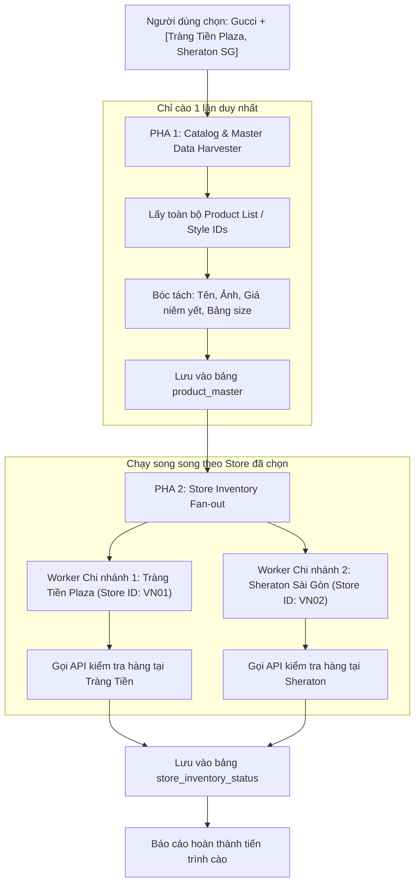

# BÁO CÁO 13: MULTI-STOREFRONT SELECTIVE SCRAPING ENGINE (ĐIỀU PHỐI CÀO THEO CHI NHÁNH)
**Dự án:** DM Fashion Data Tools (Java Web System)  
**Mục tiêu:** Cho phép người dùng tùy biến cào 1 chi nhánh hoặc chọn nhiều chi nhánh cùng một lúc mà không bị nghẽn mạng hay trùng lặp tác vụ

---

## 1. Mục đích & Nghiệp vụ trọng tâm
Người dùng có nhu cầu rất linh hoạt:
- **Tình huống A:** Chỉ muốn cào kiểm tra tồn kho & giá của đúng **1 cửa hàng** (ví dụ: `Gucci Tràng Tiền Plaza`) để phục vụ khách mua trực tiếp tại Hà Nội.
- **Tình huống B:** Muốn cào **nhiều cửa hàng được chọn** (ví dụ: `Gucci Tràng Tiền Plaza` + `Gucci Sheraton Sài Gòn`).
- **Tình huống C:** Muốn cào **toàn bộ chi nhánh trên cả nước hoặc toàn cầu** để phân tích mạng lưới phân phối.

Hệ thống điều phối (Scraping Orchestrator) viết bằng Java phải đủ thông minh để:
1. Không lặp lại việc cào thông tin tĩnh của sản phẩm (ảnh, chất liệu, kích thước giống nhau giữa các cửa hàng).
2. Tách lớp tác vụ: **Master Data Scraper** (chỉ chạy 1 lần lấy danh mục và mô tả sản phẩm) và **Store Stock Prober** (chạy song song cho từng chi nhánh được chọn).

---

## 2. Kiến trúc 2 Pha (Two-Phase Crawling Pattern)



---

## 3. Lợi ích vượt trội của mô hình 2 pha trong Java
1. **Tiết kiệm 70% băng thông và yêu cầu mạng:** Không phải tải lại hình ảnh hay parse HTML lặp lại cho từng cửa hàng.
2. **Tránh bị WAF khóa IP:** Việc kiểm tra tồn kho chi nhánh thường chỉ là các gói tin JSON nhẹ (`GET /stock?sku=...&storeId=VN01`), gửi nhanh và ít tốn tài nguyên.
3. **Dễ dàng mở rộng (Scalability):** Nếu người dùng tích chọn 20 chi nhánh, Java Virtual Threads (Project Loom trong Java 21) có thể kích hoạt 20 coroutine/virtual thread đồng thời thăm dò kho mà không tốn nhiều RAM.

---

## 4. Cấu trúc Job Request DTO trong Spring Boot

```java
public record CreateScrapeJobRequest(
    @NotBlank String brandId,                       // e.g. "gucci"
    @NotEmpty List<String> selectedStoreIds,       // e.g. ["VN01", "VN02"]
    boolean scrapeMasterData,                      // Có cần cào lại ảnh, mô tả không
    boolean highResolutionMedia,                   // Tải ảnh gốc 4K không
    int maxProductsLimit,                          // Giới hạn số lượng (0 = toàn bộ)
    Priority priority                              // NORMAL, HIGH
) {}
```
