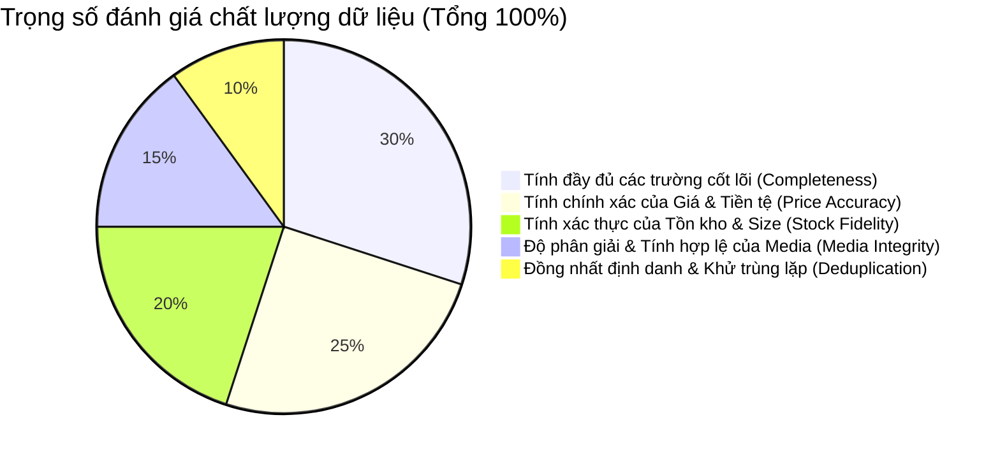

# BÁO CÁO 14: DATA ACCURACY ASSURANCE FRAMEWORK (QUY CHUẨN ĐẠT ĐỘ CHÍNH XÁC >= 90%)
**Dự án:** DM Fashion Data Tools (Java Web System)  
**Mục tiêu:** Thiết lập hệ thống kiểm soát chất lượng (QA/Validation Pipeline) tự động để đảm bảo dữ liệu cào về đạt độ chính xác từ 90% đến 99%

---

## 1. Định nghĩa Độ chính xác >= 90% trong dữ liệu Thời trang
Để đạt mục tiêu cam kết độ chính xác >= 90%, hệ thống không chỉ "cào được chữ về" mà phải đảm bảo 5 chỉ số chất lượng dữ liệu (Data Quality Dimensions):



1. **Completeness (Đầy đủ - 30%):** Sản phẩm phải có đủ Tên, SKU, Danh mục, Ít nhất 1 ảnh HD, Bảng size hoặc Kích thước vật lý.
2. **Price Accuracy (Chính xác giá - 25%):** Giá số không được âm, mã tiền tệ phải khớp quốc gia (VN -> VND, FR -> EUR), cờ `tax_included` đúng.
3. **Stock Fidelity (Xác thực tồn kho - 20%):** Trạng thái còn hàng tại chi nhánh phải phản ánh đúng kết quả API thời gian thực.
4. **Media Integrity (Tính toàn vẹn ảnh - 15%):** URL ảnh không bị lỗi 404, độ phân giải tối thiểu >= 800x800px.
5. **Deduplication (Khử trùng lặp - 10%):** Không xuất hiện 2 bản ghi cùng chung 1 SKU tại cùng 1 chi nhánh trong cùng 1 lần cào.

---

## 2. Các quy tắc kiểm định tự động bằng Java Bean Validation (Hibernate Validator)

```java
@Data
public class FashionProductValidationPayload {

    @NotBlank(message = "Product ID không được rỗng")
    private String productId;

    @NotBlank(message = "Brand không được rỗng")
    private String brand;

    @NotNull(message = "Giá bán không được null")
    @PositiveOrZero(message = "Giá sản phẩm phải >= 0")
    private BigDecimal currentPrice;

    @Pattern(regexp = "^[A-Z]{3}$", message = "Mã tiền tệ phải theo chuẩn ISO 4217 (VND, USD, EUR)")
    private String currency;

    @NotEmpty(message = "Sản phẩm phải có ít nhất 1 hình ảnh hợp lệ")
    private List<@URL String> imageUrls;

    @NotEmpty(message = "Sản phẩm phải có ít nhất 1 biến thể size/màu")
    private List<@Valid VariantDto> variants;
}
```

---

## 3. Cơ chế tính điểm tin cậy chất lượng (Quality Score Engine)
Mỗi bản ghi sau khi cào sẽ được Java ETL chấm điểm từ `0.0` đến `100.0`:
- **Điểm >= 90:** Đánh dấu `QUALITY_PASSED` -> Lưu vào kho chính thức cho người dùng xem và xuất file.
- **Điểm từ 70 đến 89:** Đánh dấu `QUALITY_WARNING` -> Vẫn lưu, gắn cờ cảnh báo thiếu trường (ví dụ: thiếu ảnh zoom cận cảnh hoặc chưa có mô tả chi tiết).
- **Điểm < 70:** Đánh dấu `QUALITY_FAILED` -> Đẩy vào bảng Quarantine (Khu vực cách ly) để crawler retry hoặc cảnh báo kỹ sư sửa parser.

---

## 4. Phát hiện bất thường (Anomaly Detection)
- **Cảnh báo lệch giá đột ngột:** Nếu giá của một chiếc túi Gucci hôm nay tụt từ 50 triệu xuống 500 nghìn (do web đổi cấu trúc HTML hoặc lỗi đơn vị), hệ thống lập tức chặn bản ghi và kích hoạt cảnh báo, tránh làm bẩn dữ liệu phân tích.
- **Kiểm tra tỷ lệ rỗng (Null-ratio Monitoring):** Nếu trong 1 mẻ cào có > 10% sản phẩm bị thiếu trường `color_name` hoặc `sizes`, hệ thống tự động tạm dừng job và thông báo WAF hoặc DOM đã thay đổi.
