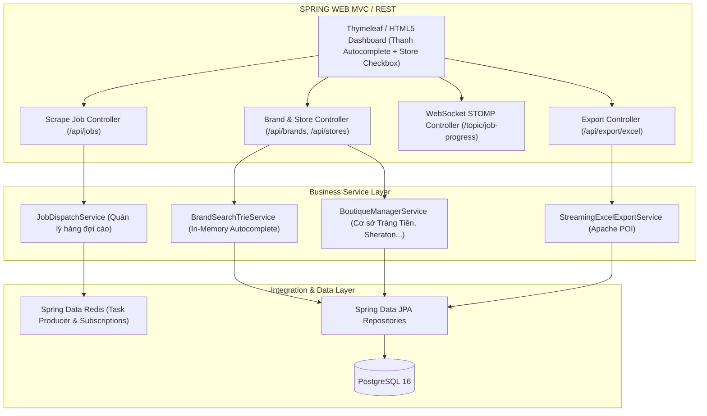

# BÁO CÁO 15: JAVA BACKEND & WEB PORTAL ARCHITECTURE BLUEPRINT
**Dự án:** DM Fashion Data Tools  
**Vai trò cốt lõi của Java:** Giao diện hiển thị (Frontend Web Portal), Điều phối tác vụ (Job Orchestration), Danh bạ thương hiệu & Chi nhánh, Quản lý CSDL PostgreSQL & Xuất báo cáo Excel

---

## 1. Mục tiêu & Vị trí của Java trong hệ thống
Người dùng yêu cầu giao diện hiển thị web chủ đạo là **Java**. Trong mô hình kiến trúc này, Java (Spring Boot 3.3, Java 21 LTS) đóng vai trò là "Bộ não trung tâm" (Master Control Plane):
- **Web UI & Presentation:** Cung cấp toàn bộ giao diện Web (qua Spring Boot MVC kết hợp Thymeleaf, HTMX, TailwindCSS hoặc Single Page Application được phục vụ trực tiếp bởi Spring Boot).
- **Brand Autocomplete & Store Directory:** Xử lý thuật toán gợi ý hãng siêu tốc (< 20ms) và quản lý cây danh sách chi nhánh (Gucci Tràng Tiền Plaza, Sheraton Sài Gòn...).
- **Job Orchestrator:** Tiếp nhận lệnh "Bắt đầu cào", đóng gói tham số cào, đẩy vào hàng đợi Redis Task Queue cho Worker xử lý, đồng thời duy trì kênh WebSocket STOMP truyền tải dữ liệu trực tiếp lên màn hình Web.
- **Data Persistence & Export:** Kiểm soát dữ liệu với PostgreSQL 16 (qua Spring Data JPA), thực thi streaming xuất file Excel (.xlsx) dung lượng lớn bằng Apache POI SXSSF.

---

## 2. Mô hình kiến trúc phân tầng của Java Web Portal



---

## 3. Thiết kế luồng xử lý Java khi người dùng thao tác

### 3.1. Gợi ý thương hiệu (Brand Autocomplete)
Khi người dùng gõ `Gucci`:
1. `BrandSearchTrieService` trong Java quét cây tiền tố (Trie) lưu trong bộ nhớ RAM (Caffeine Cache), phản hồi danh sách thương hiệu chỉ trong **5 - 15 mili-giây**.
2. Frontend nhận JSON và hiển thị menu dropdown có logo và quốc gia xuất xứ.

### 3.2. Chọn cơ sở (Store Selection)
Khi người dùng nhấn chọn `Gucci`:
1. Java Web gọi `BoutiqueManagerService` lấy danh sách chi nhánh đã cấu hình trong bảng `brand_store` thuộc quốc gia Việt Nam:
   - `[x] Gucci Tràng Tiền Plaza (Hà Nội)`
   - `[x] Gucci Sheraton Saigon (TP.HCM)`
2. Hiển thị danh sách checkbox trực quan để người dùng tích chọn 1 hoặc nhiều cơ sở.

### 3.3. Nhấn "Bắt đầu cào" (Job Dispatching)
1. Java nhận request `POST /api/jobs`:
   ```json
   {
     "brandId": "gucci",
     "storeIds": ["VN_HN_01"],
     "scope": "ALL_CATEGORIES"
   }
   ```
2. Java tạo bản ghi `ScrapeJob` trong PostgreSQL với trạng thái `RUNNING`.
3. Java đóng gói Message và đẩy vào Redis Queue: `redisTemplate.opsForList().rightPush("queue:fashion:scrape", payload);`.
4. Kênh WebSocket STOMP mở kết nối hai chiều `/topic/job/{jobId}` để sẵn sàng nhận log và phần trăm tiến độ từ Redis Pub/Sub đưa thẳng lên màn hình người dùng.

---

## 4. Cấu hình Spring Boot 3 tối ưu cho hệ thống Web
```yaml
server:
  port: 8080
spring:
  threads:
    virtual:
      enabled: true # Kích hoạt Virtual Threads Java 21
  datasource:
    url: jdbc:postgresql://localhost:5432/fashion_crawler_db
    hikari:
      maximum-pool-size: 20
  data:
    redis:
      host: localhost
      port: 6379
```
Mô hình này giúp Web Java chạy ổn định 24/7, tuyệt đối không bị treo UI khi hệ thống đang cào hàng chục nghìn sản phẩm.
