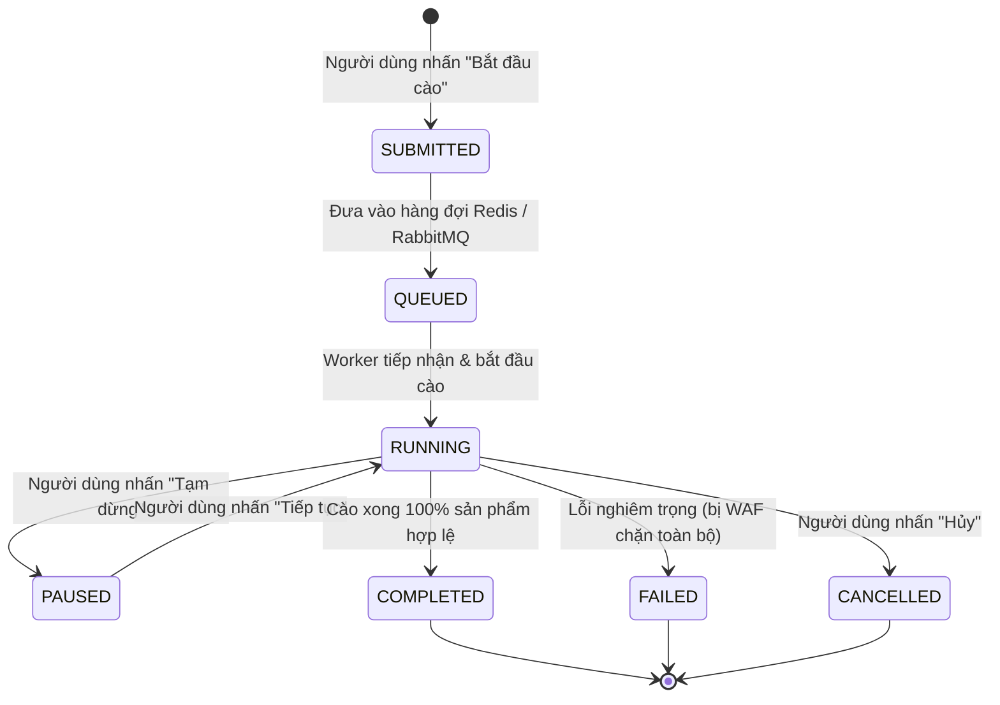
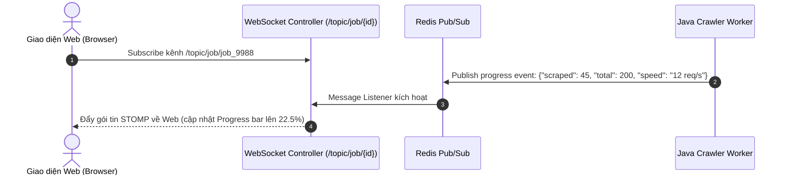

# BÁO CÁO 16: REAL-TIME SCRAPING JOB ORCHESTRATION & DISTRIBUTED TASK QUEUE
**Dự án:** DM Fashion Data Tools (Java Web System)  
**Mục tiêu:** Quản lý vòng đời tác vụ cào, hàng đợi phân tán và cập nhật tiến độ thời gian thực về giao diện Web

---

## 1. Mục đích & Nghiệp vụ
Khi người dùng chọn thương hiệu Gucci và các chi nhánh (ví dụ: Tràng Tiền Plaza), sau đó nhấn **"Bắt đầu cào"**:
1. Một tác vụ cào (Scraping Job) được khởi tạo với trạng thái `QUEUED` hoặc `RUNNING`.
2. Giao diện Web lập tức hiển thị thanh tiến trình (Progress Bar: 0% -> 100%), số lượng sản phẩm đã tìm thấy, số lượng sản phẩm cào thành công, số lỗi, và log chi tiết chạy theo thời gian thực (Live Terminal Log).
3. Người dùng có quyền: **Tạm dừng (Pause)**, **Tiếp tục (Resume)** hoặc **Hủy bỏ (Abort)** tác vụ bất kỳ lúc nào.

---

## 2. Vòng đời của một tác vụ cào (Job Lifecycle State Machine)



---

## 3. Kiến trúc luồng dữ liệu thời gian thực qua WebSocket & STOMP



---

## 4. Thiết kế cấu trúc Job Progress Entity trong cơ sở dữ liệu

```sql
CREATE TABLE scrape_job (
    job_id VARCHAR(64) PRIMARY KEY,
    brand_id VARCHAR(32) NOT NULL,
    selected_stores JSONB NOT NULL,          -- Danh sách store IDs đã chọn
    status VARCHAR(20) NOT NULL,             -- QUEUED, RUNNING, PAUSED, COMPLETED, FAILED
    total_products_discovered INT DEFAULT 0,
    total_products_scraped INT DEFAULT 0,
    total_products_failed INT DEFAULT 0,
    accuracy_score_avg NUMERIC(5,2),         -- Điểm chất lượng dữ liệu trung bình
    started_at TIMESTAMP WITH TIME ZONE,
    finished_at TIMESTAMP WITH TIME ZONE,
    error_message TEXT,
    created_by VARCHAR(64)
);
```

---

## 5. Xử lý đồng thời và kiểm soát tài nguyên trong Java
- Sử dụng **Semaphore** hoặc **ThreadPoolExecutor** có giới hạn `max_concurrent_requests_per_domain` để tránh bị máy chủ của Gucci/Dior phát hiện tấn công DDoS (khuyên dùng tối đa 3-5 request/giây trên mỗi IP dân cư).
- Tích hợp cơ chế **Heartbeat**: Định kỳ mỗi 3 giây gửi tín hiệu ping để giao diện Web biết worker vẫn đang hoạt động bình thường.
