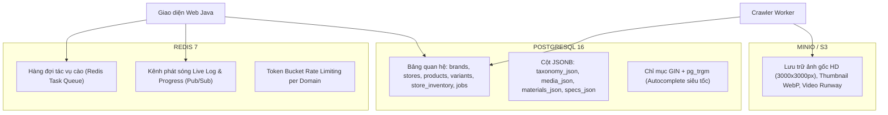

# BÁO CÁO 19: NGHIÊN CỨU & QUYẾT ĐỊNH GIẢI PHÁP LƯU TRỮ DỮ LIỆU TỐI ƯU
**Dự án:** DM Fashion Data Tools  
**Mục tiêu:** Phân tích toàn diện các hệ cơ sở dữ liệu để đưa ra quyết định lưu trữ chuẩn xác, bền vững cho hệ thống thời trang đa chi nhánh

---

## 1. Bài toán lưu trữ dữ liệu thời trang cao cấp & đa chi nhánh

Hệ thống phải đồng thời giải quyết 2 bài toán đối lập:
1. **Tính cấu trúc chặt chẽ (Relational / ACID):** Quản lý tài khoản, thương hiệu, danh bạ chi nhánh (Gucci Tràng Tiền Plaza, Sheraton Sài Gòn...), lịch sử chạy job, báo cáo kiểm kê theo thời gian thực.
2. **Tính linh hoạt phi cấu trúc (Unstructured / Polymorphic):** Mỗi hãng thời trang có các thuộc tính mô tả khác nhau (Dior có thông số túi Dài x Cao x Rộng, Adidas có công nghệ đệm Boost/Gore-Tex, Gucci có mã da thuộc và chi tiết khóa).

---

## 2. So sánh thực nghiệm các giải pháp lưu trữ

| Tiêu chí so sánh | MySQL 8.0 | MongoDB 7.0 (NoSQL) | PostgreSQL 16 (Hybrid Relational + JSONB) |
| :--- | :--- | :--- | :--- |
| **Quản lý Chi nhánh & Khóa ngoại** | ⚡ Rất tốt (Foreign Key ACID) | ❌ Kém: Phải tự quản lý liên kết, dễ phát sinh dữ liệu "mồ côi" khi xóa store. | 🏆 **Xuất sắc**: Ràng buộc toàn vẹn dữ liệu chuẩn mực giữa Hãng - Chi nhánh - Sản phẩm. |
| **Linh hoạt thuộc tính thời trang** | ⚠️ Hạn chế: Kiểu JSON chậm, không có chỉ mục GIN chuyên dụng. | ⚡ Rất tốt: Schema-less, thêm trường thoải mái. | 🏆 **Xuất sắc**: Cột `JSONB` nhị phân cực nhanh, hỗ trợ GIN Index tìm kiếm sâu trong mảng. |
| **Tìm kiếm gợi ý Hãng (Autocomplete)** | ⚠️ LIKE '%gucci%' quét toàn bảng rất chậm. | ⚠️ Phải tích hợp thêm Atlas Search phức tạp. | 🏆 **Xuất sắc**: Extension `pg_trgm` (Trigram Similarity) gợi ý gõ sai chính tả < 10ms. |
| **Tương thích hệ sinh thái Java** | ⚡ Tốt (Hibernate) | ⚠️ Mapping Document sang Object Java phức tạp. | 🏆 **Số 1**: Spring Data JPA hỗ trợ hoàn hảo cả quan hệ bảng lẫn ánh xạ JSONB. |

---

## 3. Quyết định Kiến trúc Lưu trữ: Mô hình "Tam Giác Vàng"

### Kết luận giải pháp lưu trữ:
1. **Cơ sở dữ liệu chính (Master Database):** **PostgreSQL 16**.
   - Cung cấp tính toàn vẹn quan hệ giữa **Thương hiệu -> Chi nhánh (Gucci Tràng Tiền) -> Sản phẩm -> Biến thể SKU -> Tồn kho theo ngày**.
   - Cung cấp cột `JSONB` để lưu linh hoạt mọi chi tiết thời trang mà không phải sửa cấu trúc bảng khi cào thêm hãng mới.
2. **Bộ đệm & Hàng đợi thời gian thực:** **Redis 7**.
   - Cầu nối giao tiếp giữa Web Java và Crawler Worker.
3. **Lưu trữ tệp hình ảnh/video:** **MinIO** (mã nguồn mở tự lưu trên server) hoặc **AWS S3**.
