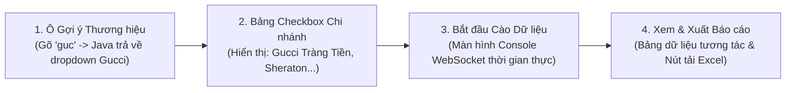

# BÁO CÁO 20: FRONTEND WEB UI/UX SPECIFICATION (GIAO DIỆN CHỦ ĐẠO BẰNG JAVA)
**Dự án:** DM Fashion Data Tools  
**Mục tiêu:** Thiết kế giao diện người dùng trực quan, hiện đại, được vận hành chủ đạo bằng công nghệ Web Java (Spring Boot MVC + Thymeleaf / HTMX hoặc Vaadin)

---

## 1. Lựa chọn Công nghệ Giao diện Web bằng Java
Để giao diện hiển thị web chủ đạo là **Java** mà vẫn đảm bảo tính hiện đại, phản hồi tức thì và mượt mà:
1. **Phương án 1 (Khuyên dùng): Spring Boot 3 + Thymeleaf + HTMX + TailwindCSS**
   - **Bản chất:** 100% được phục vụ bởi Java Controller. 
   - **Ưu điểm:** HTMX cho phép các tương tác động (gõ tìm kiếm hãng, click chọn chi nhánh, cập nhật progress bar) được xử lý trực tiếp bởi các hàm Java trên server và trả về các đoạn mã giao diện HTML nhỏ (Server-driven UI) mà không cần cài đặt Node.js hay React rườm rà.
2. **Phương án 2: Vaadin 24 (Pure Java UI Framework)**
   - **Bản chất:** Viết 100% giao diện Web (nút bấm, bảng dữ liệu, ô autocomplete, checkbox) bằng code Java thuần túy chạy trên JVM.

---

## 2. Luồng trải nghiệm người dùng 4 bước trên Web Java



---

## 3. Thiết kế chi tiết các khối chức năng trên Giao diện

### 3.1. Khối 1: Ô tìm kiếm Thương hiệu thông minh (Brand Autocomplete)
- **Mã Java Controller xử lý:**
  ```java
  @GetMapping("/ui/brands/suggest")
  public String suggestBrandsFragment(@RequestParam("q") String query, Model model) {
      List<BrandDto> brands = brandService.searchByPrefix(query);
      model.addAttribute("brands", brands);
      return "fragments/brand-suggestions :: dropdown"; // Trả về mảnh giao diện HTML
  }
  ```
- **Hành vi trên Web:**
  - Người dùng gõ chữ `G`, `Gu`, `Guc`, hoặc `guci` (gõ sai), menu xổ xuống ngay lập tức hiển thị:
    - `[Logo Gucci] Gucci - Thời trang xa xỉ Ý (Kering Group)`
    - `[Logo Guess] Guess - Thời trang đương đại Mỹ`
  - Người dùng nhấn click chuột hoặc bấm phím Enter vào **Gucci**.

### 3.2. Khối 2: Panel Chọn Chi nhánh / Cơ sở (Boutique Selector)
- Ngay khi chọn **Gucci**, khu vực cơ sở tự động nạp danh sách điểm bán:
  - **Công cụ lọc nhanh:** `[🔘 Toàn bộ Việt Nam]`, `[🔘 Chỉ Hà Nội]`, `[🔘 Chỉ TP.HCM]`.
  - **Danh sách Checkbox tương tác:**
    - `[x] 🏛️ Gucci Tràng Tiền Plaza (24 Hai Bà Trưng, P. Tràng Tiền, Hoàn Kiếm, Hà Nội)`
    - `[x] 🏨 Gucci Sheraton Saigon Hotel (88 Đồng Khởi, Bến Nghé, Quận 1, TP.HCM)`
    - `[ ] ✈️ Gucci Nội Bài Duty Free (Sân bay quốc tế Nội Bài)`
  - Người dùng có thể tích chọn 1 cơ sở (chỉ cào Tràng Tiền Plaza) hoặc tích chọn nhiều cơ sở cùng lúc.

### 3.3. Khối 3: Bảng điều khiển tiến trình Live (Real-time Scraping Monitor)
- Khi nhấn nút bấm nổi bật **`[🚀 BẮT ĐẦU CÀO DỮ LIỆU]`**:
  - Giao diện chuyển sang trạng thái theo dõi mẻ cào:
    - **Thanh Progress Bar:** `Đang cào: 342 / 850 sản phẩm (40.2%)`
    - **Tốc độ:** `18 requests/giây` | **Thời gian còn lại (ETA):** `45 giây`
    - **Độ chính xác hiện tại:** `97.8% (Đạt tiêu chuẩn >= 90%)`
    - **Hộp Live Terminal (Console Log):** Cuộn tự động dòng chữ thời gian thực qua WebSocket Java:
      ```text
      [22:04:12] [Gucci Tràng Tiền Plaza] Đã xác nhận tồn kho: Jackie 1961 (735113 FACVY 8440) -> CÒN HÀNG (2 chiếc)
      [22:04:14] [Gucci Tràng Tiền Plaza] Đã xác nhận tồn kho: Dionysus Small -> HẾT HÀNG
      [22:04:15] [Lưu CSDL] Đã lưu sản phẩm M1296ZRGO - Điểm chất lượng: 98/100
      ```
    - **Nút điều khiển:** `[⏸ Tạm dừng]`, `[⏹ Hủy cào]`.

### 3.4. Khối 4: Bảng tra cứu & Xuất dữ liệu (Data Explorer & Excel Export)
- Hiển thị bảng dữ liệu (Data Grid) trực tiếp trên Web:
  - Cột ảnh sản phẩm (rê chuột hiển thị ảnh zoom HD).
  - Tên sản phẩm, Mã SKU, Giá niêm yết, Giá bán tại Việt Nam (VND).
  - Cột trạng thái chi nhánh: `Tràng Tiền Plaza: CÒN HÀNG`, `Sheraton: HẾT HÀNG`.
  - Nút tải về: **`[📥 Xuất Báo Cáo Excel (.xlsx)]`** (Java sinh file trực tiếp và tải về trình duyệt người dùng ngay lập tức).
