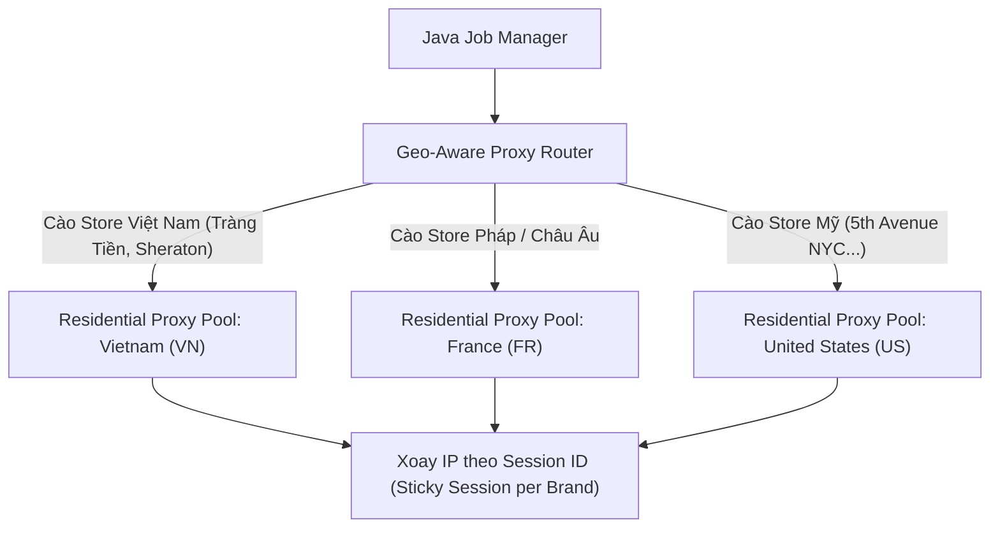

# BÁO CÁO 21: PROXY MANAGEMENT & IP ROTATION FOR PHYSICAL STORE CRAWLING
**Dự án:** DM Fashion Data Tools (Java Web System)  
**Mục tiêu:** Quản lý proxy dân cư xoay vòng và định tuyến IP theo vị trí địa lý của chi nhánh để tránh sai lệch dữ liệu

---

## 1. Tầm quan trọng của Geo-targeted Proxies
Khi người dùng chọn cào tại **Gucci Tràng Tiền Plaza (Hà Nội, VN)** hoặc **Dior Place Vendôme (Paris, Pháp)**:
- Nếu crawler sử dụng một IP ở Mỹ để gọi API kiểm tra cửa hàng Việt Nam, một số hãng sẽ tự động redirect hoặc từ chối trả về giá tiền VND và trạng thái kho nội địa.
- Nếu gửi quá nhiều request từ một dải IP, WAF (Akamai/Cloudflare) sẽ kích hoạt Captcha hoặc chặn kết nối.

---

## 2. Phân loại Proxy Pool trong Java Backend

---

## 3. Cơ chế Sticky Session vs Rotating Per Request
1. **Pha tải danh mục (Catalog Discovery):** Dùng **Rotating Proxy** (mỗi request 1 IP khác nhau) để tải hàng nghìn trang danh mục mà không bao giờ chạm ngưỡng rate-limit.
2. **Pha kiểm tra chi nhánh (Boutique Stock Prober):** Dùng **Sticky Session Proxy** (giữ nguyên 1 IP trong 5 - 10 phút) để duy trì cookie phiên làm việc, giả lập giống như một khách hàng thực sự đang duyệt xem các mẫu túi tại cửa hàng Tràng Tiền.

---

## 4. Quản lý Proxy Health Check trong Java
Hệ thống Java duy trì một background service định kỳ kiểm tra sức khỏe của proxy:
- Đo độ trễ (Latency < 800ms).
- Kiểm tra tỷ lệ thành công (Success rate >= 95%).
- Nếu một IP dính mã lỗi 403 hoặc 429, IP đó sẽ bị đưa vào danh sách đen tạm thời (Cooldown Blacklist trong 15 phút).
