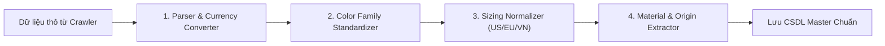

# BÁO CÁO 23: DATA NORMALIZATION & TRANSFORMATION PIPELINE IN JAVA
**Dự án:** DM Fashion Data Tools (Java Web System)  
**Mục tiêu:** Chuẩn hóa dữ liệu thô từ nhiều thương hiệu khác nhau về một cấu trúc đồng nhất, phục vụ so sánh và phân tích tập trung

---

## 1. Bài toán phân mảnh dữ liệu thời trang
Mỗi thương hiệu định nghĩa thuộc tính theo cách riêng:
- **Kích cỡ:** Gucci dùng size Ý (`IT 38`), Dior dùng size Pháp (`FR 34`), Adidas dùng size Mỹ/Anh (`US 8.5 / UK 8`).
- **Màu sắc:** Tên thương mại rất bay bổng (Gucci gọi màu be là `"Beige/Ebony GG Supreme"`, Adidas gọi `"Cloud White / Core Black"`). Người dùng tìm kiếm trên web cần lọc theo màu cơ bản: `Nâu / Be`, `Trắng`, `Đen`.
- **Đơn vị giá:** Chi nhánh Tràng Tiền trả về `VND`, store Pháp trả về `EUR`, store Mỹ trả về `USD`.

---

## 2. Quy trình chuẩn hóa bằng Java Transformation Pipeline



---

## 3. Chi tiết triển khai các bộ chuyển đổi (Converters) trong Java

### 3.1. Bảng ánh xạ họ màu sắc (Color Family Normalizer)
```java
@Component
public class ColorFamilyNormalizer {
    private static final Map<String, String> COLOR_MAP = Map.ofEntries(
        Map.entry("nero", "Black"),
        Map.entry("noir", "Black"),
        Map.entry("core black", "Black"),
        Map.entry("bianco", "White"),
        Map.entry("cloud white", "White"),
        Map.entry("chalk white", "White"),
        Map.entry("beige", "Beige"),
        Map.entry("ebony", "Brown")
    );

    public String normalizeColor(String rawColorName) {
        if (rawColorName == null) return "Unknown";
        String lower = rawColorName.toLowerCase();
        for (var entry : COLOR_MAP.entrySet()) {
            if (lower.contains(entry.getKey())) {
                return entry.getValue();
            }
        }
        return rawColorName;
    }
}
```

### 3.2. Chuẩn hóa tỷ giá & Chuyển đổi tiền tệ (Currency Normalizer)
Hệ thống Java tích hợp bộ cache tỷ giá hối đoái tự động (cập nhật từ Ngân hàng Nhà nước hoặc European Central Bank API). Khi hiển thị so sánh sản phẩm giữa chi nhánh Gucci Tràng Tiền Plaza (`VND`) và Gucci Paris (`EUR`), hệ thống tự động tính toán quy đổi ra tỷ giá VND tương đương để người dùng đối chiếu mức chênh lệch giá ngay trên giao diện Web!
