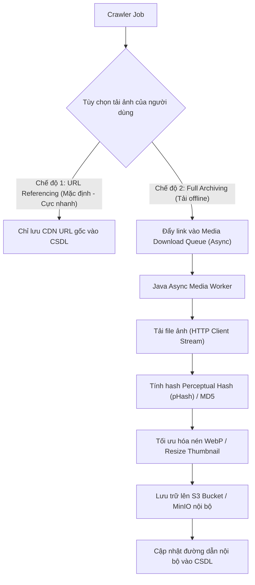

# BÁO CÁO 24: MEDIA ASSET PROCESSING & DEDUPLICATION SERVICE IN JAVA
**Dự án:** DM Fashion Data Tools (Java Web System)  
**Mục tiêu:** Xử lý tải ảnh, tối ưu hóa kích thước, băm hash chống trùng lặp và lưu trữ tài nguyên hình ảnh hiệu quả

---

## 1. Thách thức quản lý tài nguyên hình ảnh
- Một chiến dịch cào toàn bộ danh mục của Gucci, Dior và Adidas có thể sản sinh từ 50,000 đến 300,000 hình ảnh độ phân giải cao.
- Nếu tải trực tiếp toàn bộ ảnh về ổ cứng máy chủ web, dung lượng đĩa sẽ cạn kiệt rất nhanh (hàng trăm Gigabyte), đồng thời làm tăng gấp 5 lần thời gian cào.
- Nhiều ảnh cùng một dòng sản phẩm xuất hiện lặp lại trên nhiều danh mục.

---

## 2. Kiến trúc tải ảnh 2 chế độ (Lazy Streaming vs Local Caching)

---

## 3. Chống trùng lặp ảnh bằng Hashing trong Java
Để tránh việc cùng 1 chiếc túi xách nhưng do URL CDN khác nhau mà tải đi tải lại 10 lần:
- Java Service đọc header `Content-Length` và tính toán băm mã `MD5` hoặc `SHA-256` của luồng nhị phân.
- Nếu mã hash đã tồn tại trong bảng `media_asset_cache`, hệ thống chỉ tăng số đếm tham chiếu (`reference_count++`) mà không tốn dung lượng lưu trữ thêm.

---

## 4. Tối ưu hóa ảnh Web Thumbnail cho giao diện người dùng
Giao diện người dùng web chỉ cần ảnh xem trước nhẹ (< 50KB) để hiển thị mượt mà. Hệ thống sử dụng thư viện **Thumbnailator** (Java) để tạo tự động 3 phiên bản:
1. `thumbnail` (150x150 px): Dành cho bảng danh sách tra cứu nhanh.
2. `preview` (600x600 px): Dành cho cửa sổ popup xem chi tiết.
3. `original` (3000x3000 px): Lưu trên S3 cho mục đích tải về chất lượng cao.
