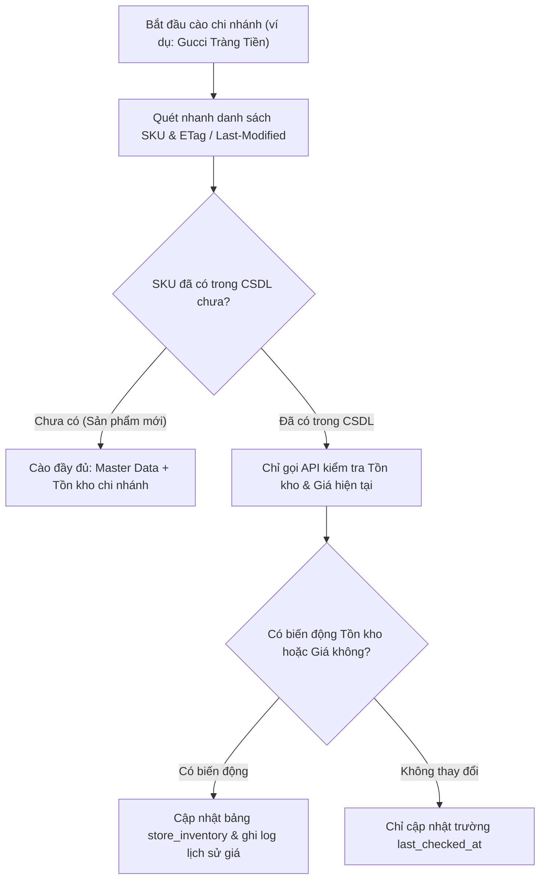

# BÁO CÁO 25: INCREMENTAL CRAWLING & DELTA CHANGE DETECTION
**Dự án:** DM Fashion Data Tools (Java Web System)  
**Mục tiêu:** Cào gia tăng thông minh, chỉ quét các thay đổi mới (Delta), tiết kiệm 80% tài nguyên mạng và thời gian xử lý

---

## 1. Vấn đề của phương pháp cào toàn phần (Full Crawl)
Nếu mỗi ngày hoặc mỗi lần bấm nút cào, hệ thống đều cào lại từ đầu toàn bộ 10,000 sản phẩm của một thương hiệu:
- Thời gian chạy kéo dài từ 3 - 6 tiếng.
- Tiêu tốn hàng trăm GB băng thông proxy dân cư đắt đỏ.
- Nguy cơ cao bị WAF kích hoạt khóa do lưu lượng bất thường.

---

## 2. Cơ chế cào gia tăng (Incremental Crawling Strategy)

---

## 3. Ứng dụng kỹ thuật ETag và Content-Hash trong Java
- Đối với các trang HTML và API, Java HTTP Client gửi kèm header `If-None-Match: <ETag>` và `If-Modified-Since: <Timestamp>`.
- Nếu máy chủ phản hồi mã `HTTP 304 Not Modified`, Java Worker lập tức bỏ qua không parse lại, tiết kiệm thời gian phân tích cú pháp DOM.
- Tự động ghi nhận các sự kiện:
  - `PRICE_DROP`: Giảm giá (cảnh báo khuyến mãi).
  - `RESTOCK`: Chi nhánh Tràng Tiền vừa nhập thêm hàng sau khi hết.
  - `OUT_OF_STOCK`: Chi nhánh vừa bán hết sạch.
