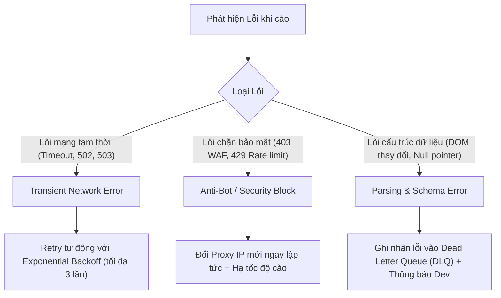

# BÁO CÁO 27: ERROR HANDLING, RETRIES & DEAD LETTER QUEUE (XỬ LÝ SỰ CỐ TỰ ĐỘNG)
**Dự án:** DM Fashion Data Tools (Java Web System)  
**Mục tiêu:** Hệ thống tự phục hồi khi gặp sự cố mạng, WAF chặn hoặc thay đổi DOM, đảm bảo job cào không bị chết giữa chừng

---

## 1. Phân loại lỗi thường gặp khi cào Luxury & Sportswear

---

## 2. Kiến trúc Dead Letter Queue (DLQ) trong RabbitMQ / Postgres
- Khi một sản phẩm cụ thể (ví dụ: một mẫu túi Gucci phiên bản giới hạn) thử cào lại 3 lần mà vẫn thất bại do cấu trúc trang bất thường:
  - Hệ thống **KHÔNG** làm dừng toàn bộ job của 1,000 sản phẩm còn lại.
  - Bản ghi lỗi được đóng gói và đưa vào bảng `scrape_dead_letter_queue` kèm thông tin: `url`, `error_stack_trace`, `http_status_code`, `timestamp`.
  - Trên Web UI hiển thị cảnh báo: *"Cào thành công 985/1000 sản phẩm. Có 15 sản phẩm thất bại cần kiểm tra lại tại tab Lỗi"*.

---

## 3. Hệ thống Cảnh báo tức thì (Webhook Alerting)
Java Backend tích hợp module gửi cảnh báo qua **Telegram Bot** hoặc **Discord Webhook** khi:
- Tỷ lệ lỗi trong một job vượt quá 10%.
- Toàn bộ Proxy dân cư trong pool bị cạn kiệt băng thông hoặc hết hạn.
- Cửa hàng lớn (ví dụ: Gucci Tràng Tiền) có đợt cập nhật hàng loạt mã sản phẩm mới.
