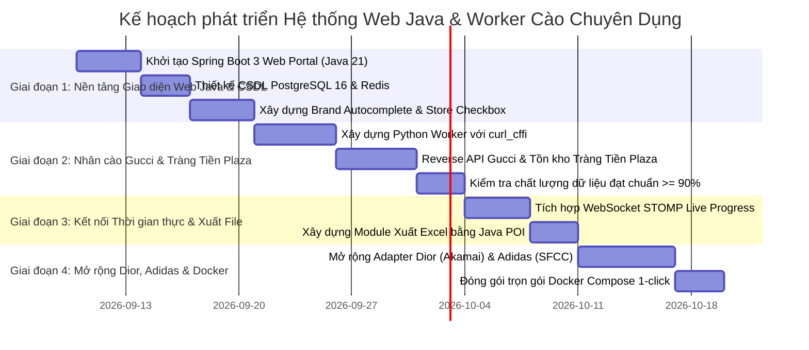

# BÁO CÁO 30: SYSTEM INTEGRATION & STEP-BY-STEP DEVELOPMENT ROADMAP
**Dự án:** DM Fashion Data Tools  
**Mục tiêu:** Lộ trình từng bước (Step-by-Step Roadmap) phát triển hoàn chỉnh hệ thống Web Java kết hợp Worker cào chuyên dụng

---

## 1. Lộ trình phát triển qua 4 Giai đoạn (Milestones)

---

## 2. Chi tiết từng giai đoạn thực thi

### Giai đoạn 1: Khởi tạo Giao diện Web Chủ Đạo Bằng Java & CSDL (Tuần 1)
- Tạo dự án Spring Boot 3 (Java 21) với các thư viện: `spring-boot-starter-web`, `spring-boot-starter-data-jpa`, `spring-boot-starter-websocket`, `thymeleaf`.
- Thiết lập CSDL **PostgreSQL 16** với các bảng quan hệ: `fashion_brand`, `brand_store`, `product_master`, `product_variant`, `store_inventory`.
- Cấu hình **Redis 7** để chuẩn bị sẵn kênh hàng đợi tác vụ.
- Xây dựng giao diện web:
  - **Ô tìm kiếm Autocomplete:** Gõ chữ gợi ý nhanh các hãng (Gucci, Dior, Adidas...).
  - **Panel cơ sở:** Khi bấm chọn Gucci, hiện ngay danh sách checkbox: `Gucci Tràng Tiền Plaza`, `Gucci Sheraton Sài Gòn`.

### Giai đoạn 2: Xây dựng Nhân Cào Chuyên Dụng & Adapter Gucci (Tuần 2)
- Xây dựng Worker Python sử dụng `curl_cffi` (giả lập Chrome 124 TLS Fingerprint để vượt Akamai Bot Manager của Gucci).
- Viết logic kiểm tra tồn kho tại cơ sở thực tế:
  - Gọi API store-finder kiểm tra xem mẫu túi Jackie 1961, Horsebit 1955 có sẵn tại chi nhánh **Tràng Tiền Plaza** không.
  - Chạy hệ thống đánh giá chất lượng (QA Scorer): Đảm bảo đầy đủ tên, giá tiền VND, ảnh HD, màu sắc, tình trạng hàng đạt **>= 90%**.

### Giai đoạn 3: Ghép nối Hai Chiều & Báo cáo Thời gian thực (Tuần 3)
- Kết nối Java Web với Python Worker qua Redis:
  - Người dùng bấm **"Bắt đầu cào"** trên Web -> Java đẩy job vào Redis.
  - Python nhận job, cào và bắn tiến độ (%) kèm live log về Redis Pub/Sub.
  - Java WebSocket chuyển tiếp ngay lên giao diện Web: Thanh progress bar chạy mượt mà, log cuộn chữ hiển thị từng sản phẩm.
- Tích hợp tính năng **Xuất báo cáo Excel (.xlsx)** bằng Apache POI Streaming (SXSSF).

### Giai đoạn 4: Mở rộng Dior, Adidas & Đóng gói Docker (Tuần 4)
- Viết tiếp Adapter cho **Dior** (bóc tách danh mục, tồn kho boutique) và **Adidas** (kiểm tra tồn kho theo size chân tại các cửa hàng Việt Nam).
- Tạo file `docker-compose.yml` kết nối toàn bộ hệ thống (Java Web + Python Worker + PostgreSQL + Redis), cho phép chạy trên bất kỳ máy tính nào chỉ với 1 lệnh.
