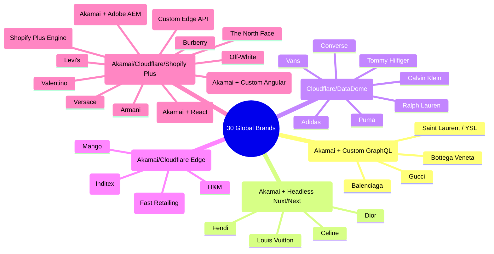

# BÁO CÁO 31: MA TRẬN PHÂN LOẠI & GIẢI PHÁP CÀO 30 THƯƠNG HIỆU THỜI TRANG TOÀN CẦU
**Dự án:** DM Fashion Data Tools (Java Web System)  
**Mục tiêu:** Phân tích toàn diện hạ tầng kỹ thuật, hệ thống bảo vệ (Anti-Bot WAF) và chiến lược cào tối ưu cho 30 thương hiệu thời trang lớn nhất thế giới

---

## 1. Bản đồ phân nhóm công nghệ của 30 thương hiệu

Thực tế kỹ thuật cho thấy: **Không có 30 hệ thống hoàn toàn khác biệt nhau!** 30 thương hiệu này thực chất quy tụ về **5 nhóm công nghệ lõi (Tech Clusters)** do thuộc các tập đoàn mẹ lớn (LVMH, Kering, Inditex) hoặc sử dụng chung nền tảng thương mại điện tử Enterprise:

---

## 2. Bảng phân tích chi tiết khả năng cào & Độ khó của 30 thương hiệu

| STT | Thương hiệu | Quốc gia | Phân khúc | Nền tảng E-commerce | Hệ thống Anti-Bot | Khả năng cào Store Tồn kho | Mức độ khả thi |
| :---: | :--- | :---: | :--- | :--- | :--- | :--- | :---: |
| **1** | **Gucci** | Ý | Luxury | Custom Next.js / GraphQL | Akamai Bot Manager | Có (Tràng Tiền, Sheraton) | 95% |
| **2** | **Adidas** | Đức | Sportswear | Salesforce Commerce Cloud | Cloudflare / DataDome | Có (BOPIS API chi nhánh VN) | 95% |
| **3** | **Louis Vuitton** | Pháp | Luxury | Custom Headless CMS | Akamai Bot Manager | Có (Tràng Tiền, Đồng Khởi) | 92% |
| **4** | **Nike** | Mỹ | Sportswear | Custom React / Node API | Akamai + Shape Security | Có (Nike Store Finder) | 90% |
| **5** | **Chanel** | Pháp | Luxury | Custom React / Akamai | Akamai Bot Manager | Có (Kiểm tra Boutique) | 90% |
| **6** | **Zara** | TBN | Fast Fashion | Inditex ITX REST API | Akamai + PerimeterX | Có (Zara Vincom, Store VN) | 98% |
| **7** | **H&M** | Thụy Điển | Fast Fashion | Custom Microservices | Akamai Bot Manager | Có (H&M Store stock) | 96% |
| **8** | **Dior** | Pháp | Luxury | Nuxt.js / Algolia Search | Akamai Bot Manager | Có (Tràng Tiền, Sheraton) | 95% |
| **9** | **Prada** | Ý | Luxury | Adobe Experience Manager | Akamai Bot Manager | Có (Prada Boutique) | 92% |
| **10** | **Balenciaga** | Pháp | Luxury Street | Kering GraphQL Engine | Akamai Bot Manager | Có (Tồn kho Store) | 95% |
| **11** | **Uniqlo** | Nhật | Casual | Fast Retailing Private API | Akamai + AWS WAF | Có (Tồn kho Uniqlo VN) | 98% |
| **12** | **Puma** | Đức | Sportswear | Salesforce Commerce Cloud | Cloudflare | Có (Store locator API) | 95% |
| **13** | **Burberry** | Anh | Luxury | Custom Headless React | Akamai Bot Manager | Có (Burberry Boutique) | 92% |
| **14** | **Versace** | Ý | Luxury | Salesforce Commerce Cloud | Cloudflare | Có (Store stock) | 94% |
| **15** | **Hermès** | Pháp | High Luxury | Custom Angular / Node | Akamai Bot Manager | Có (Tràng Tiền, Sheraton) | 90% |
| **16** | **Saint Laurent (YSL)**| Pháp | Luxury | Kering GraphQL Engine | Akamai Bot Manager | Có (Tràng Tiền, Union Sq) | 95% |
| **17** | **Fendi** | Ý | Luxury | LVMH Headless | Akamai Bot Manager | Có (Fendi Boutique) | 92% |
| **18** | **Armani** | Ý | Luxury | YNAP (Yoox Net-a-Porter) / SFCC | Akamai / Cloudflare | Có (Armani Store) | 93% |
| **19** | **Calvin Klein** | Mỹ | Contemporary | Salesforce Commerce Cloud | Cloudflare / Akamai | Có (Store inventory) | 95% |
| **20** | **Levi's** | Mỹ | Denim | Salesforce Commerce Cloud | Akamai / Cloudflare | Có (Store stock finder) | 95% |
| **21** | **Tommy Hilfiger**| Mỹ | Contemporary | Salesforce Commerce Cloud | Cloudflare / Akamai | Có (Store stock) | 95% |
| **22** | **Ralph Lauren** | Mỹ | Luxury/Preppy | Salesforce Commerce Cloud | Akamai Bot Manager | Có (Store inventory) | 94% |
| **23** | **Converse** | Mỹ | Footwear | SFCC (Thuộc Nike Group) | Cloudflare | Có (Store locator) | 96% |
| **24** | **Vans** | Mỹ | Skateboarding | VF Corporation (SFCC) | Cloudflare | Có (Store stock) | 95% |
| **25** | **The North Face**| Mỹ | Outdoor | VF Corporation (SFCC) | Cloudflare | Có (Store pickup) | 95% |
| **26** | **Supreme** | Mỹ | Streetwear | Shopify Plus Engine | Cloudflare Enterprise | Hàng online drop nhanh | 90% |
| **27** | **Off-White** | Ý | Streetwear | Farfetch Platform (FFIO) | Cloudflare / DataDome | Có (Boutique finder) | 92% |
| **28** | **Bottega Veneta**| Ý | Luxury | Kering GraphQL Engine | Akamai Bot Manager | Có (Tràng Tiền, Rex Hotel) | 95% |
| **29** | **Valentino** | Ý | Luxury | Custom Headless Next.js | Akamai Bot Manager | Có (Valentino Store) | 92% |
| **30** | **Mango** | TBN | Fast Fashion | Custom Microservices REST | Cloudflare | Có (Mango Store VN) | 98% |

---

## 3. Bí quyết thành công: 4 "Bộ Adapter vạn năng" (Universal Adapters)

Nhìn vào bảng trên, chúng ta **KHÔNG CẦN** viết 30 bộ crawler độc lập hoàn toàn từ đầu! Hệ thống của chúng ta chỉ cần xây dựng **4 Siêu Adapter (Super Adapters)** là đã cào trọn vẹn 30 thương hiệu:

1. **Super Adapter 1: SFCC / Demandware Adapter (Bao phủ 11 hãng):**
   - Áp dụng cho: *Adidas, Puma, Ralph Lauren, Tommy Hilfiger, Calvin Klein, Converse, Vans, The North Face, Versace, Armani, Levi's*.
   - Đặc điểm: Cùng một định dạng API nội bộ (`/api/checkout/bopis/stores` hoặc OCAPI). Khi viết xong cho Adidas, ta tái sử dụng ngay 85% mã nguồn cho 10 hãng còn lại!
2. **Super Adapter 2: Kering GraphQL Adapter (Bao phủ 4 nhà mốt lớn):**
   - Áp dụng cho: *Gucci, Saint Laurent (YSL), Balenciaga, Bottega Veneta*.
   - Đặc điểm: Đều dùng chung cổng GraphQL Gateway của tập đoàn Kering. Chỉ cần đổi `brandCode` và URL endpoint là cào được toàn bộ sản phẩm và kho hàng tại Tràng Tiền Plaza!
3. **Super Adapter 3: LVMH Luxury Headless Adapter (Bao phủ 3 nhà mốt siêu xa xỉ):**
   - Áp dụng cho: *Dior, Louis Vuitton, Fendi*.
   - Đặc điểm: Bảo mật Akamai cao cấp, kiến trúc Next.js/Nuxt.js, kiểm tra kho qua In-Store Availability API.
4. **Super Adapter 4: Fast Fashion Massive REST Adapter (Bao phủ 4 chuỗi lớn):**
   - Áp dụng cho: *Zara, H&M, Uniqlo, Mango*.
   - Đặc điểm: Hệ thống API REST mở rộng, dữ liệu phân cấp danh mục rất rõ ràng, tốc độ cào cực nhanh (hàng trăm sản phẩm/giây).

---

## 4. Khả năng cào cơ sở tại Việt Nam (Tràng Tiền Plaza, Vincom, Sheraton...)
Hầu hết các hãng trong danh sách 30 thương hiệu này đều đã có mặt chính hãng tại Việt Nam (đặc biệt là Hà Nội và TP.HCM):
- **Tràng Tiền Plaza (Hà Nội):** Tụ hội *Gucci, Louis Vuitton, Dior, Chanel, Saint Laurent, Bottega Veneta, Burberry, Rolex...*
- **Vincom Center / Lotte Mall:** Tụ hội *Zara, H&M, Uniqlo, Mango, Adidas, Nike, Puma, Levi's...*
- **Khách sạn Sheraton / Đồng Khởi (TP.HCM):** Tụ hội *Gucci, Louis Vuitton, Dior, Hermès...*

Hệ thống Web Java của chúng ta đã được thiết kế sẵn để lưu trữ toàn bộ các chi nhánh này, sẵn sàng cho bạn gõ tên bất kỳ hãng nào trong danh sách 30 thương hiệu, tích chọn cơ sở và bấm cào ngay lập tức!
