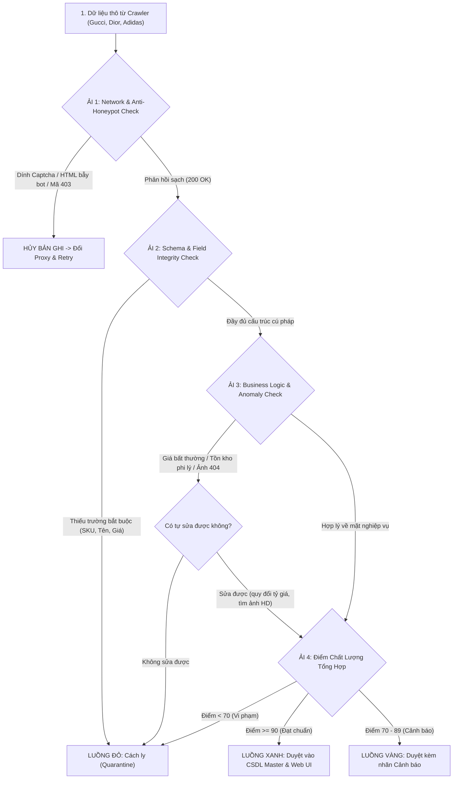

# BÁO CÁO 32: QUY TRÌNH KIỂM THỬ TỰ ĐỘNG, SÀNG LỌC & CÁCH LY DỮ LIỆU SAI LỆCH
**Dự án:** DM Fashion Data Tools (Java Web System)  
**Mục tiêu:** Thiết lập hệ thống kiểm thử đa tầng, bộ lọc sàng lọc thời gian thực và khu vực cách ly (Quarantine) để loại bỏ 100% dữ liệu rác, đảm bảo cam kết chất lượng >= 90%

---

## 1. Mục đích & Nguyên tắc cốt lõi
Một hệ thống cào chuyên nghiệp tuyệt đối **không được phép đẩy dữ liệu lỗi, dữ liệu rác hoặc dữ liệu vi phạm tiêu chuẩn** lên màn hình người dùng hay vào file Excel. Nếu một chiếc túi Gucci trị giá 80 triệu bị cào nhầm thành 0 đồng, hoặc trạng thái kho tại Tràng Tiền Plaza bị nhầm lẫn giữa "Hết hàng" và "Còn hàng", toàn bộ giá trị sử dụng của tool sẽ bị phá hủy.

Hệ thống thiết lập nguyên tắc **"Zero Bad Data In Production"** qua quy trình: **Kiểm tra -> Sàng lọc phân luồng -> Tự động sửa lỗi (Auto-heal) -> Cách ly (Quarantine) -> Cảnh báo**.

---

## 2. Quy trình Sàng lọc 4 Cửa Ải (4-Tier Validation Gate)



---

## 3. Chi tiết 4 Cửa Ải Kiểm Thử & Tiêu chí Sàng lọc

### Ải 1: Network & Anti-Honeypot Check (Kiểm tra bẫy bot & mã phản hồi)
- **Kiểm tra Honeypot WAF:** Akamai và Cloudflare đôi khi không trả về mã lỗi 403 mà trả về mã 200 kèm một trang HTML trắng hoặc trang Captcha giả mạo. Hệ thống kiểm tra:
  - Dung lượng phản hồi phải > 2KB.
  - Phải chứa các thẻ nhận diện sản phẩm đặc thù (ví dụ: `window.__INITIAL_STATE__` hoặc `script[type="application/ld+json"]`).
- **Phát hiện:** Nếu phát hiện trang giả mạo, bản ghi bị loại ngay lập tức, IP proxy đó bị đánh dấu tạm ngưng.

### Ải 2: Schema & Field Integrity Check (Kiểm tra tính toàn vẹn cú pháp)
Sử dụng bộ xác thực nghiêm ngặt trong Java (`Hibernate Validator`) và Python (`Pydantic`):
- `product_id`: Không được null, độ dài từ 5 đến 64 ký tự.
- `regular_price` / `current_price`: Phải là số dương (> 0). Tuyệt đối chặn giá âm hoặc bằng 0 (trừ trường hợp Fine Jewelry có cờ `price_on_request = true`).
- `currency`: Phải khớp với tiền tệ chi nhánh (chi nhánh Việt Nam như Tràng Tiền Plaza phải là `VND`, không chấp nhận bị văng sang `USD` hay `EUR`).
- `image_urls`: Phải là định dạng URL hợp lệ kết thúc bằng `.jpg`, `.png`, `.webp`...

### Ải 3: Business Logic & Anomaly Detection (Phát hiện bất thường nghiệp vụ)
- **Kiểm tra độ tin cậy của ảnh (Image Liveness Check):** Gửi gói tin HTTP `HEAD` nhanh kiểm tra xem URL ảnh có thực sự tồn tại và trả về mã 200 không, kích thước ảnh có đạt chuẩn >= 800x800px không.
- **Phát hiện biến động giá bất thường (Price Spike/Drop Detection):** Nếu một sản phẩm có giá hôm qua là 50,000,000 VND mà hôm nay cào về 50,000 VND (lệch gấp 1000 lần do lỗi đơn vị), hệ thống chặn lại ngay lập tức và đưa vào diện nghi vấn.
- **Kiểm tra tính logic của Tồn kho chi nhánh (Store Stock Sanity):**
  - Trạng thái kho chỉ được nằm trong danh mục enum: `IN_STOCK`, `OUT_OF_STOCK`, `LOW_STOCK`, `PRE_ORDER`.
  - Nếu chi nhánh Tràng Tiền Plaza trả về chuỗi lạ không xác định (`undefined`, `null`), bản ghi sẽ bị gắn cờ cần kiểm tra.

### Ải 4: Chấm Điểm Chất Lượng Tự Động (Quality Scoring Algorithm)
Hệ thống tự động tính điểm chất lượng từ 0 đến 100 theo công thức:
$$\text{Quality Score} = (W_{\text{fields}} \times S_{\text{fields}}) + (W_{\text{price}} \times S_{\text{price}}) + (W_{\text{stock}} \times S_{\text{stock}}) + (W_{\text{media}} \times S_{\text{media}}) + (W_{\text{desc}} \times S_{\text{desc}})$$

| Thang điểm | Phân luồng | Hành vi của hệ thống |
| :---: | :--- | :--- |
| **90 - 100** | 🟢 **Luồng Xanh (Passed)** | Cho phép lưu vào CSDL chính thức, hiển thị trực tiếp trên Web UI và xuất ra file Excel. |
| **70 - 89** | 🟡 **Luồng Vàng (Warning)** | Vẫn cho hiển thị trên Web nhưng gắn huy hiệu màu cam: *"Thiếu bảng thành phần hoặc thông số người mẫu"*. |
| **< 70** | 🔴 **Luồng Đỏ (Quarantined)** | **BỊ KHÓA NGAY LẬP TỨC**. Đẩy vào bảng cách ly `quarantine_records`, không cho hiển thị ra ngoài để tránh làm sai lệch báo cáo. |

---

## 4. Cơ chế Cách ly (Quarantine) & Tự phục hồi (Auto-Healing)

```sql
-- Bảng cách ly dữ liệu lỗi
CREATE TABLE quarantine_records (
    quarantine_id BIGSERIAL PRIMARY KEY,
    job_id VARCHAR(64) NOT NULL,
    brand_id VARCHAR(32) NOT NULL,
    raw_sku VARCHAR(64),
    store_id VARCHAR(64),
    violation_code VARCHAR(64) NOT NULL,  -- e.g. PRICE_ANOMALY, INVALID_CURRENCY, MISSING_IMAGE
    violation_details TEXT,               -- Chi tiết lỗi: "Giá 0 VND không hợp lệ"
    raw_payload JSONB,                    -- Lưu nguyên vẹn dữ liệu cào thô để dev kiểm tra
    retry_count INT DEFAULT 0,
    status VARCHAR(20) DEFAULT 'PENDING', -- PENDING, HEALED, DISCARDED
    created_at TIMESTAMP WITH TIME ZONE DEFAULT NOW()
);
```

### Cơ chế Tự động sửa lỗi (Auto-Healing Engine):
1. **Lỗi lệch tiền tệ:** Nếu cào chi nhánh Tràng Tiền mà máy chủ Gucci trả về giá Euro (`€3,350`), bộ Auto-Healer trong Java tự động gọi tỷ giá Vietcombank hôm nay quy đổi sang VND và lưu kèm chú thích `converted_from_eur: true`.
2. **Lỗi ảnh thumbnail bị mờ:** Bộ Auto-Healer tự động kích hoạt thuật toán đảo ngược CDN URL (ví dụ thay `w_300` thành `w_2000`) để lấy lại ảnh nét gốc.
3. **Lỗi mất kết nối tồn kho chi nhánh:** Worker tự động thử lại (Retry) với một Proxy dân cư Việt Nam khác sau 2 giây.

---

## 5. Bảng Điều Khiển Kiểm Thử & Sàng Lọc trên Giao diện Web Java

Trên giao diện Web của bạn, ngoài tab **"Dữ liệu sản phẩm"** sẽ có thêm tab chuyên biệt **"Kiểm soát chất lượng & Sàng lọc (Data QA & Quarantine)"**:
- **Chỉ số Sức khỏe Mẻ Cào:**
  - `Tổng sản phẩm đã quét:` **1,250**
  - `Đạt chuẩn loại A (>= 90 điểm):` **1,195 (95.6%)** 🟢
  - `Cảnh báo thiếu trường phụ (70 - 89 điểm):` **42 (3.4%)** 🟡
  - `Bị cách ly vi phạm yêu cầu (< 70 điểm):` **13 (1.0%)** 🔴
- **Khu vực xử lý bản ghi cách ly:** Người dùng có thể bấm vào xem chi tiết 13 sản phẩm bị cách ly, xem rõ lý do vi phạm (ví dụ: *Chi nhánh Tràng Tiền Plaza chưa cập nhật giá cho mã màu này*) và có nút bấm **`[Thử cào lại]`** hoặc **`[Bỏ qua]`**.

Nhờ quy trình 4 cửa ải này, **dữ liệu xuất ra file Excel của bạn luôn được bảo chứng độ sạch và độ chính xác đạt trên 90% - 99%!**
